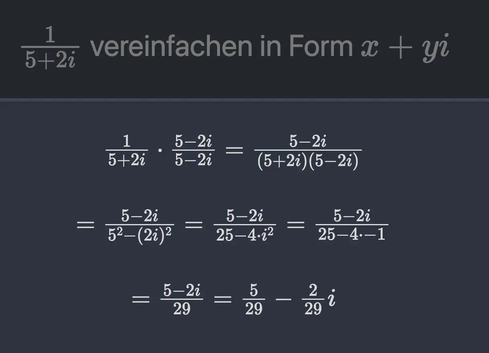

# Anki-Random-Template

_A vibe-coded anki template that allows random values_




## Usage

copy the content of `front.html` into your front of the card template, `back.html` into the back, `style.css` content into the style ...

# Usage Info

A single Anki note field **`vars`** holds all variable definitions, one per line.
Front / Back templates then reference them with the `@` sigil.

---

## `vars` field

Each non-empty, non-comment line defines one variable:

```
a = 3
b = 2.1
myvar = -15
rand = [-5, 3]
sr = [0.1, 0.5]
res := a + b + 1
xy := abs(rand)
pp := pi * 2
```

- `name = value` — constant, explicit list, or random range
- `name := expr` — computed from other variables (any order; cycles -> NaN)
- `#` and `//` start comments; blank lines are ignored

### Value forms

| Form             | Meaning                                                             |
| ---------------- | ------------------------------------------------------------------- |
| `7`              | constant `7`                                                        |
| `1, 2, 3`        | explicit list (random pick)                                         |
| `[-10, 3]`       | random integer in `[-10, 3]` **inclusive** (step 1)                 |
| `[0.1, 0.3]`     | random from `{0.1, 0.2, 0.3}` — step inferred from decimals written |
| `[0.001, 1.000]` | step `0.001` → e.g. `0.471`                                         |

The number of **decimals written** in the bounds sets the step:
`[-5, 3]` → step 1 · `[0.1, 0.3]` → step 0.1 · `[0.001, 1.000]` → step 0.001.

### Expressions

`:=` equations are JS expressions with `Math` in scope, so `sqrt`, `abs`,
`sin`, `floor`, `round`, `min`, `max`, … and the constants `pi`, `e`, `tau`
are available bare. `^` is treated as `**` (power).

---

## Template syntax (sigil: `@`)

`@` is used instead of `$` so it never clashes with MathJax `$ … $` math mode.
You can freely wrap math in `$ … $`, `\( … \)`, or `\[ … \]` and use `@` inside.

| Syntax     | Result                                    |
| ---------- | ----------------------------------------- |
| `@name`    | the variable's value                      |
| `@(expr)`  | evaluated expression                      |
| `@+(expr)` | evaluated, sign always shown (`+` or `-`) |
| `@+name`   | the variable's value, sign always shown   |

### Examples

```
@a + @b = @(a + b)
@res
@(floor(3 / 2))
@(1/3)            ->  \frac{1}{3}
@+(-1 * -3)       ->  +3
@+a               ->  +<value of a>   (sign always shown)
3 @+(1 * 4)       ->  3 +4
$\sqrt{@a^2 + @b^2}$
@(1 == 1)         ->  true
@(a == 2)         ->  true or false
```

### Number formatting

- **Integers** render plain: `7`
- **Terminating decimals** render plain, rounded to `decimals` (default 3):
  `0.5`, `2.1`
- **Non-terminating rationals** render as reduced LaTeX fractions:
  `1/3` → `\frac{1}{3}`, `2/3` → `\frac{2}{3}`, `1/6` → `\frac{1}{6}`
  (but `1/2` → `0.5`, `4/2` → `2`)
- **Irrationals** (`sqrt(2)`, `pi`, …) render as decimals since no exact
  small fraction exists: `sqrt(2)` → `1.414`

`@+(expr)` prepends the sign to whatever form the value takes, so
`@+(1/3)` → `+\frac{1}{3}` and `@+(-1/3)` → `-\frac{1}{3}`.

> `\frac{…}` requires math mode — wrap the surrounding math in `$ … $` etc.

### Boolean values

Expressions are real JavaScript, so comparisons and logic produce
**booleans**, rendered as the words `true` / `false`:

| Expression          | Result                           |
| ------------------- | -------------------------------- |
| `@(1 == 1)`         | `true`                           |
| `@(1 == 2)`         | `false`                          |
| `@(a == 2)`         | `true` if `a` is 2, else `false` |
| `@(a > 0 && b < 5)` | `true` / `false`                 |
| `@(a != 3)`         | `true` / `false`                 |

All JS comparison (`==`, `!=`, `<`, `>`, `<=`, `>=`) and logical
(`&&`, `||`, `!`) operators work. A `:=` equation may also hold a
boolean, and `@name` then shows `true`/`false`. `@+(expr)` leaves a
boolean as-is (no leading `+`).

---

## Required note fields

`vars`, `Front`, `Back` — and optionally `decimals` (default `3`) and `Title`.

# Credits

The general card style is from: [AnkiTUM](https://github.com/hmelder/AnkiTUM) (the styling)
